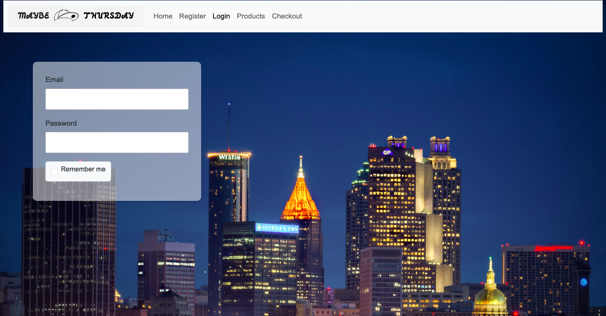
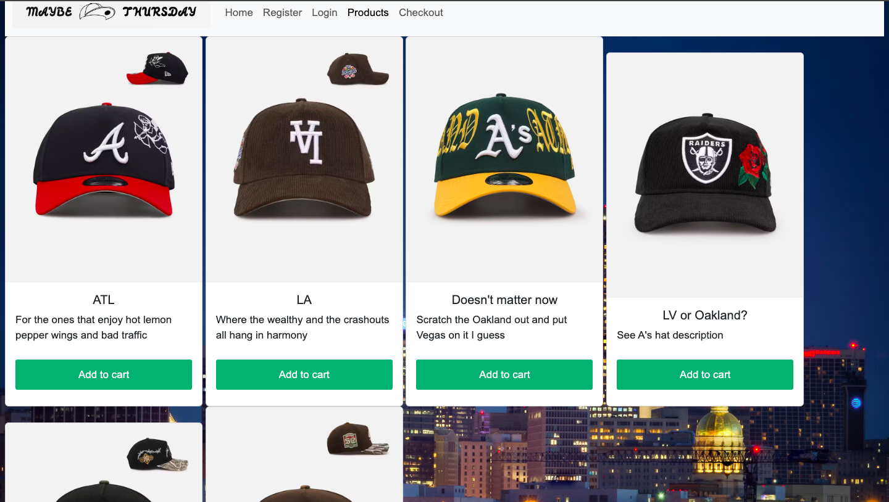
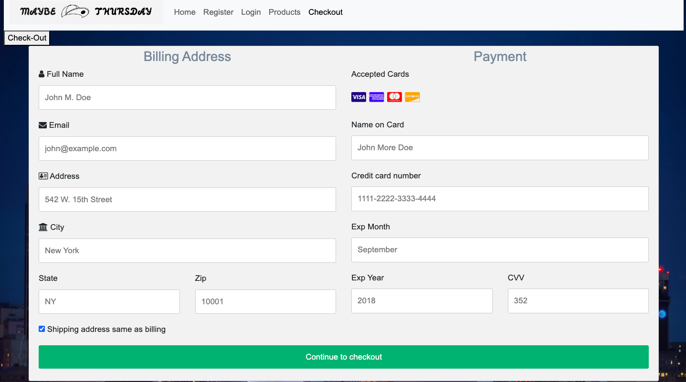
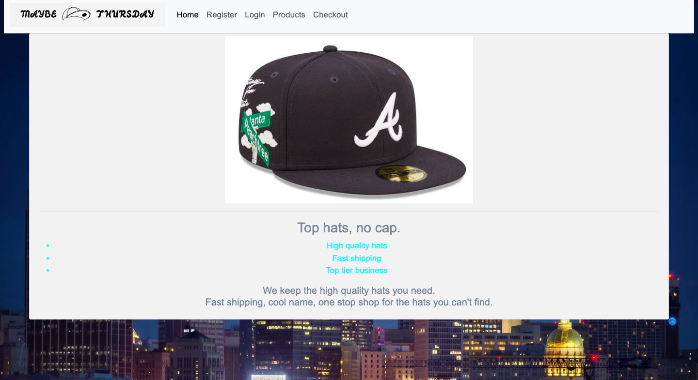

# maybe thursday
Hat store with login, registration, products, and checkout page. 

## login page
login page has email and password boxes for returning users, along with a remember check box for future visits.

## registration page
registration page has email, password, password confirmation, and username entry boxes for new users. Also radio buttons for 'how did you hear about us' section

## products page 
products page uses bootstrap cards to display all six products. Products are accompanied by witty one liners and add to cart buttons.

## checkout page
Checkout page includes payment and billing form. Customers can fill out their credit card and payment details and see a list of accepted payment methods

Homepage includes logo, store slogan, picture, and a brief summary of the store
